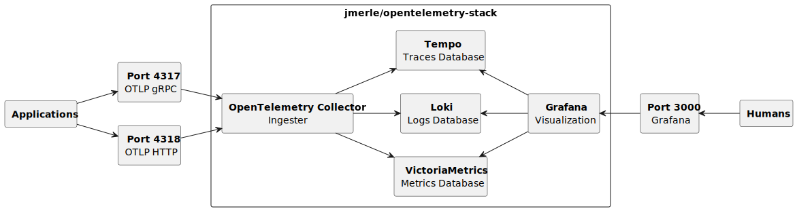

# Docker OpenTelemetry Stack

The [jmerle/opentelemetry-stack](https://hub.docker.com/r/jmerle/opentelemetry-stack) Docker image contains a complete OpenTelemetry stack consisting of Grafana, VictoriaMetrics, Tempo, Loki, Pyroscope, and the OpenTelemetry Collector. The code in this repository is partially based on the [grafana/docker-otel-lgtm](https://github.com/grafana/docker-otel-lgtm) repository.



## Usage

The following command starts the complete stack:
```
docker run --rm --name opentelemetry -p 3000:3000 -p 4040:4040 -p 4317:4317 -p 4318:4318 -v opentelemetry:/data jmerle/opentelemetry-stack
```

The following services will be available after starting up:
- Grafana on [http://localhost:3000/](http://localhost:3000/) with default username _admin_ and password _admin_. You'll be prompted to change the password after logging in for the first time. Datasources for VictoriaMetrics, Tempo, Loki, and Pyroscope are pre-configured, as well as an overview dashboard showing the most important statistics of these datasources.
- Pyroscope on port 4040.
- The OpenTelemetry Collector on port 4317 (gRPC) and 4318 (HTTP).

Retention periods are configured as follows:
- VictoriaMetrics: 90 days
- Tempo: 30 days
- Loki: 30 days
- Pyroscope: 14 days

Set the `GF_SERVER_DOMAIN` environment variable to the domain Grafana is running on (e.g. `GF_SERVER_DOMAIN=grafana.example.com`) when using a reverse proxy.
